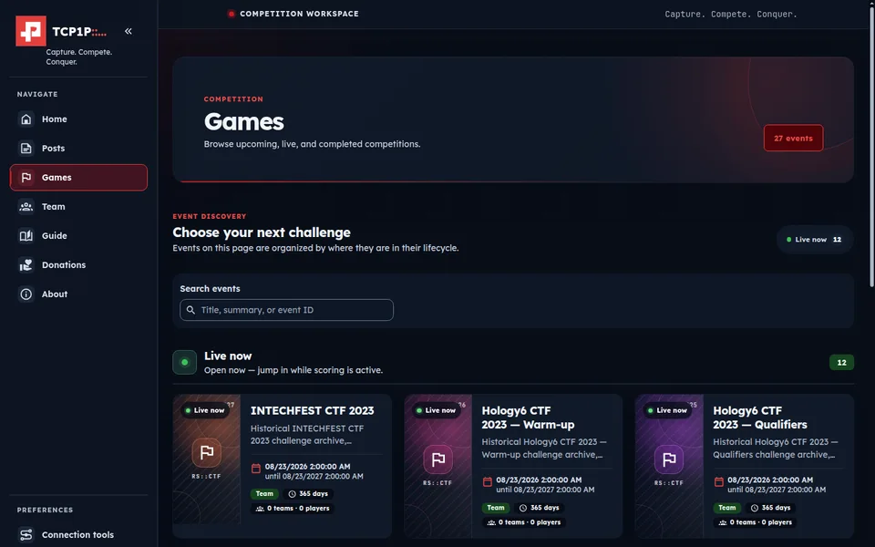
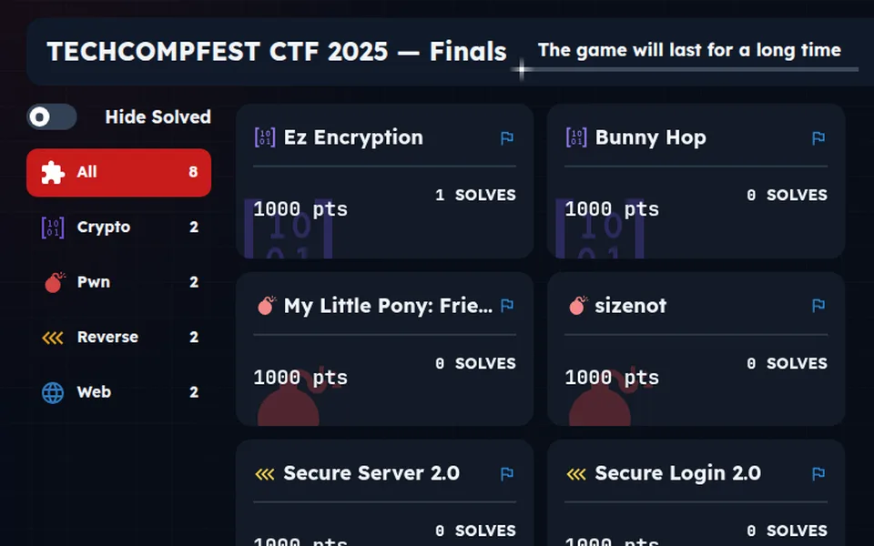
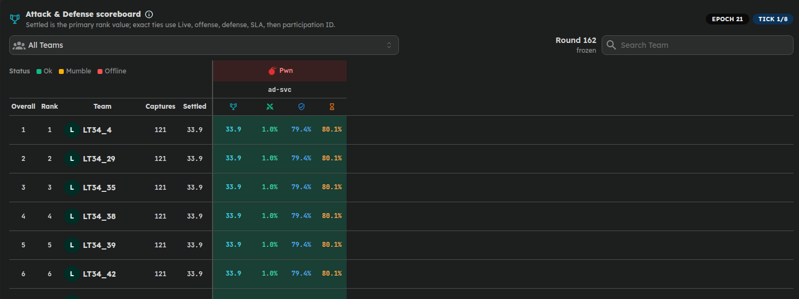
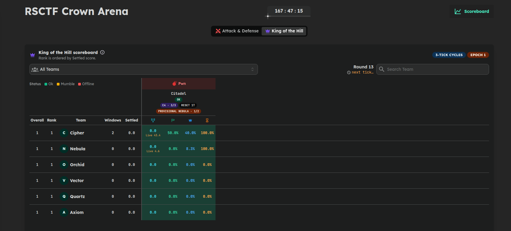
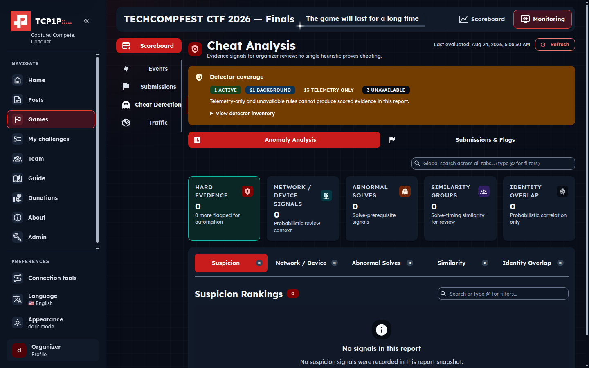

# rsctf

rsctf is a Rust platform for running Capture-the-Flag competitions with a React and Mantine frontend. It supports accounts, teams, Jeopardy challenges, dynamic containers, scoreboards, event administration, Attack & Defense, and King of the Hill.

<p align="center">
  
</p>

## Three competition engines

One installation can host ordinary Jeopardy events, infrastructure-heavy Attack & Defense matches, and King of the Hill arenas. Each engine has its own player workflow, scoring model, admin controls, and live scoreboard.

### Jeopardy

Run static or dynamic challenges with categories, attachments, hints, flags, deadlines, first-blood bonuses, per-division scoring, and practice archives. Dynamic challenges can build on demand, run on a trusted worker, and expose either a direct port, an event VPN endpoint, or a Platform Proxy/WSRX connection.

<p align="center">
  
</p>

### Attack & Defense

RSCTF provisions per-team services, distributes rotating flags, runs checker rounds, tracks SLA and attack/defense results, manages patch and reset workflows, and gives players scoped API tokens, SSH access, targets, and WireGuard profiles.

<p align="center">
  
</p>

### King of the Hill

KotH supports shared hills, timed crown cycles, health and control checks, cooldown/reset phases, token-based control, and an epoch-aware scoreboard. A hill can be a managed network service or an API arena with server-verified objectives.

<p align="center">
  
</p>

## Evidence-backed cheat review

The monitoring workspace correlates hard evidence, network/device signals, abnormal solve order, timing similarity, identity overlap, suspicious submissions, flag transport, VPN telemetry, and traffic-capture health. Organizers can inspect the source evidence and detector coverage, record reviews or exemptions, and apply blocks with an audit trail. Signals are presented for human review; the platform does not treat one heuristic as proof.

<p align="center">
  
</p>

## Feature overview

| Area | Included capabilities |
| --- | --- |
| Players and teams | Password or OAuth registration, optional OAuth-only registration, email confirmation, invitations, team membership, divisions, participation approval, responsive navigation, and light/dark themes |
| Event discovery | Searchable event catalog, joined/not-joined filters and badges, schedules, notices, rules, webhooks, global challenge search restricted to joined events, and read-only post-event archives |
| Challenge delivery | Static challenges, real attachments, dynamic Docker or Kubernetes workloads, immutable build/pull status, on-demand image builds, lifecycle limits, practice instances, BYOC, and Linux or Windows trusted workers |
| Networking | Direct host/port mappings, Platform Proxy with WSRX or copyable WSS URLs, integrated WireGuard, per-event VPN access gates, protected routes, and VPN-specific port behavior |
| Scoring | Jeopardy dynamic scoring, divisions, optional blood bonuses, live scoreboards, A&D rounds/SLA/flag capture, and KotH crown-cycle scoring |
| Organizer operations | Event and challenge editors, real instance previews, Git repository bindings and imports, team/user administration, build and image inventory, safe pruning, worker enrollment, logs, traffic views, and event monitoring |
| Guidance and accessibility | Permanent screenshot-based player handbook, resumable interactive coach marks, contextual container/VPN tips, keyboard navigation, screen-reader semantics, reduced motion, and layouts audited down to 320 px |
| Platform services | PostgreSQL and Redis, bounded background reconciliation, SMTP, optional Trakteer donations and donor leaderboard, Docker Compose, Helm/Kubernetes, role-separated replicas, health checks, and verified release installers |

The [documentation](docs/index.md) covers player workflows, organizer operations, deployment, security, configuration, backups, updates, and troubleshooting.

## Install

Users do not need to clone the repository or compile the application. Verify
the published installer before it downloads the matching release bundle:

```bash
(
  set -euo pipefail
  tmp="$(mktemp -d)"
  trap 'rm -rf "$tmp"' EXIT
  curl_args=(--disable --fail --silent --show-error --location \
    --proto '=https' --proto-redir '=https' --tlsv1.2 --connect-timeout 15 \
    --max-time 300 --retry 5 --retry-all-errors --retry-max-time 300 \
    --speed-limit 1024 --speed-time 30)
  latest="$(curl "${curl_args[@]}" --max-filesize 1048576 \
    -o /dev/null -w '%{url_effective}' \
    https://github.com/dimasma0305/rsctf/releases/latest)"
  prefix='https://github.com/dimasma0305/rsctf/releases/tag/'
  [[ "$latest" == "$prefix"* ]]
  version="${latest#"$prefix"}"
  [[ "$version" =~ ^v[0-9]+\.[0-9]+\.[0-9]+$ ]]
  base="https://github.com/dimasma0305/rsctf/releases/download/${version}"
  curl "${curl_args[@]}" --max-filesize 1048576 \
    -o "$tmp/install.sh" "$base/install.sh"
  curl "${curl_args[@]}" --max-filesize 16777216 \
    -o "$tmp/attestation.json" \
    "$base/rsctf-worker-agent-attestation.json"
  gh attestation verify "$tmp/install.sh" \
    --bundle "$tmp/attestation.json" \
    --hostname github.com \
    --repo dimasma0305/rsctf \
    --signer-workflow dimasma0305/rsctf/.github/workflows/worker-agent-release.yml \
    --source-ref "refs/tags/$version" \
    --deny-self-hosted-runners
  bash "$tmp/install.sh" --ref "$version"
)
```

The verified bundle supplies the exact `ghcr.io/dimasma0305/rsctf@sha256:…`
image built from the same tag; it never defaults to `latest`. A new database
grants the first administrator role only to a registration carrying the
private setup token generated by the installer or Helm chart.

## Documentation

The task-oriented documentation covers:

- Guided Docker installation and automatic HTTPS
- Kubernetes deployment with Helm
- First login and platform setup
- Player guides for Jeopardy, A&D, and KotH
- Organizer event and challenge workflows
- Configuration, backup, update, security, and troubleshooting
- GitHub Pages, Docker image publishing, and challenge repository bindings

Run the docs locally:

```bash
cd docs
corepack enable
pnpm install --frozen-lockfile
pnpm dev
```

Build the deployable static site with `pnpm build`. GitHub Actions publishes the result to GitHub Pages.

## Deployment choices

| Path | Best for | Entry point |
| --- | --- | --- |
| Docker Compose | One server or VM | `scripts/install.sh` |
| Kubernetes | Existing cluster | `oci://ghcr.io/dimasma0305/charts/rsctf` |
| Specialized homelab | Existing Traefik + full A&D VPN | Root `docker-compose.yml` |

The generic deployment defaults to platform-only mode. Dynamic Docker challenges require the host Docker socket, which is root-equivalent access. The integrated WireGuard VPN additionally requires Linux, `NET_ADMIN`, `NET_RAW` for its iptables ipset matcher, `/dev/net/tun`, and one VPN-enabled rsctf replica.

## Trusted workers

Dedicated Linux and native Windows-container Docker hosts can connect outbound
to RSCTF without a public IP or inbound port. After configuring the server
worker plane, use the command shown in `/admin/workers`. The bootstrap verifies
the release checksum and privately prompts for the one-use token; no GitHub CLI,
login, or token in the command is required:

```sh
(t=$(mktemp) || exit 1; trap 'rm -f "$t"' 0 HUP INT TERM; wget -q -T 30 -O "$t" https://ctf.example/install/worker && sh "$t" --server-url https://ctf.example)
```

```powershell
& ([scriptblock]::Create((Invoke-RestMethod https://ctf.example/install/worker.ps1))) -ServerUrl https://ctf.example
```

Tagged releases publish checksum-verified Linux AMD64/ARM64 archives and a
Windows AMD64 archive on
[GitHub Releases](https://github.com/dimasma0305/rsctf/releases). The admin page
supplies one copyable command for Linux and one for Administrator PowerShell;
both require a dedicated-host acknowledgement and prompt for the one-use token
without putting it in history or process arguments. On Linux, the same command
uses a native systemd service when systemd is active and otherwise creates a
Docker-supervised agent container with a durable, labeled identity volume.
Safe production use still requires a quota-capable Docker storage driver; the
explicit unbounded-storage escape hatch is only for trusted disposable
development workers. See the
[trusted-worker deployment guide](docs/deploy/workers.md) for
server setup, enrollment, provenance verification, and source builds.

## Repository layout

```text
src/                 Rust/axum backend
web/                 React, Mantine, and Vite client
docs/                VitePress documentation site
deploy/              Generic image-based Docker deployment
charts/rsctf/        Kubernetes Helm chart
scripts/install.sh          Interactive installation wizard
scripts/install-worker.sh   Linux worker-agent installer
scripts/install-worker.ps1  Windows worker-agent installer
.github/workflows/   CI, docs deployment, and image publishing
```

The Rust source keeps controllers, services, models, repositories, and migrations in predictable domain-oriented modules. See [AGENTS.md](AGENTS.md) for repository conventions.

## Contributing from source

Source builds are for contributors and image publishing, not normal installation.

For an isolated local stack with PostgreSQL, Redis, automatic Rust rebuilds,
and Vite hot module replacement, run:

```bash
node scripts/dev.mjs
```

Open `http://localhost:63000`. The development database, storage, and secrets
live under a separate Compose project and ignored `.rsctf-dev/` directory; the
workflow never uses production data or requires a GitHub push. See the
[source-development guide](docs/reference/source-development.md) for remote SSH
forwarding, port overrides, status, and shutdown commands.

```bash
cargo test --locked

cd web
corepack enable
pnpm install --frozen-lockfile
pnpm check
pnpm test
pnpm build
```

The production Dockerfile builds the React client and Rust release binary into one runtime image.
See the [testing and coverage reference](docs/reference/testing.md) for the
database-backed suite, coverage baseline, agent checks, and event-scale harness.

## Security

Before exposing rsctf publicly, read the [deployment security guide](docs/deploy/security.md). Back up both PostgreSQL and the uploaded-file volume. Never commit deployment `.env` files, Kubernetes Secret values, repository PATs, or live CTF credentials.

## License

RSCTF is free and open-source software under the [MIT License](LICENSE.txt).
See the [licensing guide](LICENSING.md) and [NOTICE](NOTICE) for details,
including the vendored [CreepJS MIT license](web/src/lib/creepjs/LICENSE).
