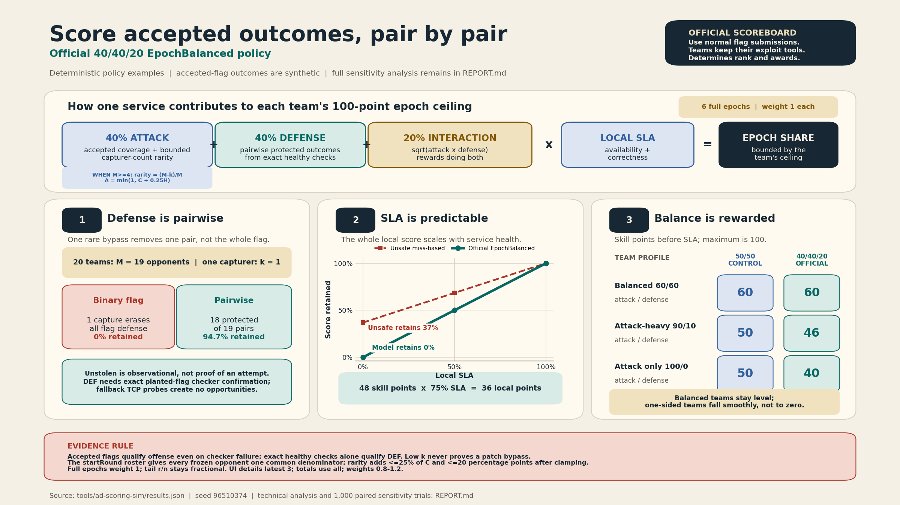

# A&D Scoring Simulation Report

Generated deterministically by `node tools/ad-scoring-sim/simulate.mjs`.

## Decision

rsctf's deployed official A&D policy is `EpochBalanced`, represented by the simulator row `manual-equal-balanced`. It replaces the old `1/k` rarity pool for ranking and awards in AI-heavy events; `manual-equal-arithmetic` remains the arithmetic governance control. Both use only ordinary accepted flags, rotating-flag eligibility, and local checker SLA; teams keep and run their exploit tooling themselves.

Declare the global `startRound` only when at least two accepted teams have every enabled A&D service and every enabled A&D challenge has a prepared exact custom checker. Freeze the ranked team-service roster from the flags minted in that round and reuse it for every epoch. Teams or services absent from that snapshot, and captures attributed to them, do not enter official scoring. For each offense-eligible flag, let `M=N-1` be its frozen opponent count and `k` the distinct accepted frozen-roster capturers. An exact healthy custom check or any such accepted capture makes the flag offense-eligible, after which every frozen opponent receives the same attack opportunity. A capturer records one capture plus rarity fraction `(M-k)/M` when `M>=4`; otherwise the rarity fraction is zero.

Across an epoch, `C=captures/attack opportunities`, `H=sum(rarity fractions)/attack opportunities`, and `A=min(1,C+0.25*H)`. The rarity coefficient adds at most 25% of base capture coverage; after the `A<=1` clamp, the realized lift is never more than 20 percentage points. Accepted capturer count is its only input. A rare flag is a difficulty proxy, not proof of a patch bypass.

Only an exact healthy custom check creates `M` pairwise defense opportunities and `M-k` protected opportunities for the victim, so `D=sum(M-k)/sum(M)`. An accepted capture can preserve offense evidence during a checker failure, but it cannot mint defense eligibility. One rare bypass removes one pair instead of erasing the whole flag's defense. This is still observational: an unstolen pair does not prove that an exploit was attempted. A fallback TCP probe does not qualify. Let `R` be local checker SLA. The arithmetic control uses `Core=0.5*A+0.5*D`; the official balanced policy uses `Core=0.4*A+0.4*D+0.2*sqrt(A*D)`, and `Local=100*R*Core`. Evidence is aggregated over the epoch before applying the nonlinear core once.

Complete epochs each have weight 1. Production precommits `n` in `[1,64]` so the unresolved raw evidence window stays bounded. A live or final partial tail with `r` observed ticks out of `n` configured ticks has weight `r/n`, so a one-tick tail never receives a full epoch budget. During live play, `settledTotal` is the weighted average of finalized epochs only, while `projectedTotal` includes all current evidence and the fractional open tail. A normal epoch finalizes only after its last flag lifetime closes. Game end closes and finalizes the partial tail at the same fractional weight, after which settled and projected totals converge. The list UI retains the latest three epoch detail rows, but both totals use the complete epoch history.

Each service has a precommitted operator-set weight in `[0.8,1.2]`, snapshotted with the flag/round and normalized across services so the epoch ceiling remains 100. This is a modest adjustment for service sloppability or inherent difficulty, not dynamic rarity. The first complete ranked roster with prepared exact custom checkers establishes the published `startRound`; all earlier evidence is excluded.

## Evidence Boundary

At the 2026-07-10T22:45:34Z audit snapshot, the two surviving games contained zero attacks. All 1,351 captured flags belong to deleted-game cohorts consistent with lifecycle-load signatures, and every one had exactly one capturer. Of 15,814 deleted-game cohort checker rows, 15,528 (98.2%) were NULL-credit InternalError placeholders; attacked cohorts had zero positive SLA observations. Observed 5/8/60/250/300-team topologies anchor scaling checks, but the simulator consumes no raw database rows. Reproduce the scoped aggregates and orphan exclusions with `historical-audit.sql`.

The stochastic profiles, exploit diffusion, patch hazards, and availability are synthetic assumptions. They test failure modes and sensitivity, not real player behavior.

## Production Parity

`manual-equal-balanced` mirrors the deployed official evidence and formula boundary. The simulator keeps one stable team count for every round, matching the roster frozen from `startRound`, and gives every frozen opponent the same denominator for an offense-eligible flag. Positive simulated checker credit stands in for an exact healthy custom-check result; an accepted frozen-roster capture can independently qualify offense reachability. `rsctf-legacy-gamma-0` is retained only as the retired fixed-pot comparison. The simulator does not model delayed submission across rsctf's five-tick flag lifetime, so live finalization timing remains qualitative.

The SLA grid is frozen service x scoring round. Offline/Mumble earns zero, the immediately following OK earns 0.5, and a clean OK earns 1. A missing check row is zero rather than a smaller denominator. `InternalError` carries the last scored non-infrastructure credit and effective status after `startRound`. An isolated first `InternalError` earns zero for that service. Only when every frozen service for a challenge-round has a first `InternalError` is the sample void for the full roster as a field-wide checker outage.

## Cross-Model Comparison Protocol

Native scores are intentionally not compared: the legacy observational control is approximately `U+ATK+U*DEF`, while epoch models are bounded 0-100 scores with whole-score SLA multiplication. Cross-model conclusions use paired ranks, rank correlation, top-three overlap, winner flips, comeback rates, and within-model SLA retention. Rank discards margins and can exaggerate near-tie changes; these diagnostics are sensitivity evidence, not a fairness proof.

| Formula | Scenario | U | Retained |
| --- | --- | --- | --- |
| manual-equal-balanced | exclusive-attacker | 0 | 0% |
| manual-equal-balanced | exclusive-attacker | 0.25 | 25% |
| manual-equal-balanced | exclusive-attacker | 0.5 | 50% |
| manual-equal-balanced | exclusive-attacker | 0.75 | 75% |
| manual-equal-balanced | exclusive-attacker | 1 | 100% |
| manual-equal-balanced | uncaptured-defender | 0 | 0% |
| manual-equal-balanced | uncaptured-defender | 0.25 | 25% |
| manual-equal-balanced | uncaptured-defender | 0.5 | 50% |
| manual-equal-balanced | uncaptured-defender | 0.75 | 75% |
| manual-equal-balanced | uncaptured-defender | 1 | 100% |
| manual-equal-arithmetic | exclusive-attacker | 0 | 0% |
| manual-equal-arithmetic | exclusive-attacker | 0.25 | 25% |
| manual-equal-arithmetic | exclusive-attacker | 0.5 | 50% |
| manual-equal-arithmetic | exclusive-attacker | 0.75 | 75% |
| manual-equal-arithmetic | exclusive-attacker | 1 | 100% |
| manual-equal-arithmetic | uncaptured-defender | 0 | 0% |
| manual-equal-arithmetic | uncaptured-defender | 0.25 | 25% |
| manual-equal-arithmetic | uncaptured-defender | 0.5 | 50% |
| manual-equal-arithmetic | uncaptured-defender | 0.75 | 75% |
| manual-equal-arithmetic | uncaptured-defender | 1 | 100% |
| maturity-positive-defense | exclusive-attacker | 0 | 36.88% |
| maturity-positive-defense | exclusive-attacker | 0.25 | 52.66% |
| maturity-positive-defense | exclusive-attacker | 0.5 | 68.44% |
| maturity-positive-defense | exclusive-attacker | 0.75 | 84.22% |
| maturity-positive-defense | exclusive-attacker | 1 | 100% |
| maturity-positive-defense | uncaptured-defender | 0 | 0% |
| maturity-positive-defense | uncaptured-defender | 0.25 | 25% |
| maturity-positive-defense | uncaptured-defender | 0.5 | 50% |
| maturity-positive-defense | uncaptured-defender | 0.75 | 75% |
| maturity-positive-defense | uncaptured-defender | 1 | 100% |

The exclusive-attacker rows expose the policy difference: the official model and arithmetic control retain exactly `U*100%` of their own healthy score, while the legacy observational model retains accepted ATK even at `U=0`. The synthetic rows contain no infrastructure faults; production applies the frozen-grid `InternalError` policy above rather than treating the verdict as team downtime.

## Copying And Collusion Stress

These 20-team controls compare one capturer (`k=1`) with a second capturer and then all eligible opponents (`k=M=19`). Retained is the original pioneer's score. Coalition gain is total attacker score after all teams submit divided by the one-attacker control. Victim damage uses a matched counterfactual where the same attackers remain active against other targets; victim/attack is one capture's negative defense damage divided by its attack reward. Both maturity rows are evaluated with every eligible opponent in `Q_v`, so they show the fully mature ceiling rather than the early default. For positive DEF, the negative victim-damage fields are `n/a`; "Defended +DEF" is the healthy missed target's gain, and competitive issuance is `ATK+DEF` in that matched control. "% old ATK" compares it with maturity-negative `0.45` ATK on the identical round and context.

| Formula | k=2 retained | k=M retained | Rare/common | Coalition gain x | Victim damage x | Victim/attack | Defended +DEF | ATK+DEF issued | % old ATK |
| --- | --- | --- | --- | --- | --- | --- | --- | --- | --- |
| rsctf-legacy-gamma-0 | 50% | 5.26% | 19 | 1 | 1 | 1 | n/a | n/a | n/a |
| sqrt-transfer-gamma-0.5 | 70.71% | 22.94% | 4.359 | 4.359 | 4.359 | 1 | n/a | n/a | n/a |
| flat-transfer-gamma-1 | 100% | 100% | 1 | 19 | 19 | 1 | n/a | n/a | n/a |
| normalized-coverage-conserved | 100% | 100% | 1 | 19 | 19 | 1 | n/a | n/a | n/a |
| bounded-scarcity-conserved | 97.3% | 51.35% | 1.947 | 9.757 | 9.757 | 1 | n/a | n/a | n/a |
| maturity-gated-scarcity-conserved | 97.3% | 51.35% | 1.947 | 9.757 | 9.757 | 1 | n/a | n/a | n/a |
| maturity-positive-defense | 97.3% | 51.35% | 1.947 | 9.757 | n/a | n/a | 0.2767 | 0.8302 | 100 |
| manual-equal-arithmetic | 98.94% | 80.85% | 1.237 | 15.362 | 19 | 0.809 | n/a | n/a | n/a |
| manual-equal-balanced | 98.94% | 80.85% | 1.237 | 15.362 | 19 | 0.809 | n/a | n/a | n/a |
| ictf-fixed-pot | 50% | 5.26% | 19 | 1 | 1 | 1 | n/a | n/a | n/a |
| active-attacker-matrix | 100% | 100% | 1 | 19 | 19 | 1 | n/a | n/a | n/a |
| bounded-coverage-normalized | 100% | 100% | 1 | 19 | 19 | 0.875 | n/a | n/a | n/a |
| bounded-coverage-normalized-45-30-25 | 100% | 100% | 1 | 19 | 19 | 0.667 | n/a | n/a | n/a |

The retired fixed-pot rarity model keeps coalition payout and victim loss fixed, but a pioneer's score falls 50% at the second capture and 94.74% under field-wide AI diffusion. Square-root rarity softens, but does not remove, that effect. Bounded scarcity is the middle negative-defense control: at 20 teams `k=2` retains 97.3% of the pioneer's sole-capture score and field-wide copying retains 51.35%. The official model and arithmetic control instead give every accepted capturer base coverage and only a bounded `(M-k)/M` premium. Their pairwise defense falls by `1/M` per distinct capturer, so one bypass cannot erase the entire flag's DEF.

The explicit funnel control has 19 attackers capture every peer except one ally. The legacy observational model awards that ally 2.842105 DEF (3.842105 including quality). Manual arithmetic/balanced award 50/40 DEF and totals 50/40, because all of the ally's pairwise outcomes remain protected. This is the known observational weakness: coordinated withholding can inflate DEF, and accepted-flag data alone cannot prove an attempt.

## Maturity Gate And Negative Control

For this maturity-negative control, `M=19`, `k=1`, and supplied victim-relative `Q_v` fixes `A`. At `A<=4`, `w=0` and its `0.45` attack share is exactly normalized no-rarity coverage. The smooth ramp starts at five active attackers and reaches full weight at eight; the share continues increasing with `A` and equals bounded scarcity only when `A=M`. The observational positive-defense control uses the identical `w(A)` multiplier with a `0.30` attack weight and no victim debit.

| A | w(A) | -DEF sole ATK | vs no-rarity | -DEF victim debit |
| --- | --- | --- | --- | --- |
| 1 | 0 | 0.023684 | 1 | -0.023684 |
| 4 | 0 | 0.023684 | 1 | -0.023684 |
| 5 | 0.1563 | 0.026645 | 1.125 | -0.026645 |
| 6 | 0.5 | 0.033553 | 1.4167 | -0.033553 |
| 7 | 0.8438 | 0.040813 | 1.7232 | -0.040813 |
| 8 | 1 | 0.044408 | 1.875 | -0.044408 |
| 19 | 1 | 0.046122 | 1.9474 | -0.046122 |

Qualification requires two distinct other victims and two distinct mint ticks; neither a one-tick sweep nor repeatedly farming one victim is enough. This raises the cost of manufacturing maturity, but does not remove the incentive to coordinate cheap valid captures across targets.

## Field-Size Scaling

Each cell is an exclusive full-field sweep's attack score divided by one healthy additive quality tick. Multiplicative manual models are intentionally omitted because they have no additive quality denominator. The invariance requirement is that the ratio remains O(1) as team count grows. Normalized coverage is exactly 0.45 at every field size. Both maturity rows supply every eligible opponent in `Q_v`: the negative row equals 0.8763 at 20 teams and approaches 0.9, while the observational positive row is exactly two-thirds of it, equals 0.5842 at 20 teams, and approaches 0.6. The bounded control intentionally uses a 40/25 offense-to-direct-quality ratio, so its stable target is 1.6.

| Teams | Legacy 1/k | Sqrt | Flat | Normalized | Scarcity | Maturity -DEF | Maturity +DEF | Matrix | Bounded |
| --- | --- | --- | --- | --- | --- | --- | --- | --- | --- |
| 5 | 1.7889 | 0.8944 | 0.4472 | 0.45 | 0.7875 | 0.45 | 0.3 | 1 | 1.6 |
| 8 | 2.4749 | 0.9354 | 0.3536 | 0.45 | 0.8357 | 0.7754 | 0.517 | 1 | 1.6 |
| 20 | 4.2485 | 0.9747 | 0.2236 | 0.45 | 0.8763 | 0.8763 | 0.5842 | 1 | 1.6 |
| 60 | 7.6169 | 0.9916 | 0.1291 | 0.45 | 0.8924 | 0.8924 | 0.5949 | 1 | 1.6 |
| 250 | 15.7481 | 0.998 | 0.0632 | 0.45 | 0.8982 | 0.8982 | 0.5988 | 1 | 1.6 |
| 300 | 17.2628 | 0.9983 | 0.0577 | 0.45 | 0.8985 | 0.8985 | 0.599 | 1 | 1.6 |

The power-law conserved family is `X=P*(k/M)^gamma`, where `X` is transferred score, `k` is capturers, and `M=N-1` is eligible opponents frozen when the flag is minted. A sole attacker sweeping the field earns `P*M^(1-gamma)`. Against the retired additive SLA scale `P*sqrt(N)`, `gamma=0.5` is the unique scale-matched exponent in that legacy family. It remains a sensitivity comparator; the official model and arithmetic control normalize accepted attack opportunities and pairwise protected defense opportunities independently.

## Named Campaigns

The early-farmer/late-adapter control gives team 0 identical sweeps in the first two epochs and team 1 identical sweeps in the last two. Equal epochs must tie; positive deltas under recency show the recency rule alone creates a late bonus. The defense/SLA control has one active attacker, one target that remains uncaptured, and peers that are captured; "uncaptured advantage" is observable non-capture, not proof that the attacker tried that target or that a patch blocked it. Values are each formula's native units and must not be compared across rows.

| Formula | Equal late-early | Moderate late-early | Heavy late-early | Uncaptured advantage |
| --- | --- | --- | --- | --- |
| rsctf-legacy-gamma-0 | 0 | 4 | 8 | 3 |
| sqrt-transfer-gamma-0.5 | 0 | 0.9177 | 1.8353 | 0.6882 |
| flat-transfer-gamma-1 | 0 | 0.2105 | 0.4211 | 0.1579 |
| normalized-coverage-conserved | 0 | 0.0947 | 0.1895 | 0.0711 |
| bounded-scarcity-conserved | 0 | 0.1845 | 0.369 | 0.1384 |
| maturity-gated-scarcity-conserved | 0 | 0.0947 | 0.1895 | 0.0711 |
| maturity-positive-defense | 0 | 0.06 | 0.12 | 0.4263 |
| manual-equal-arithmetic | 0 | 10.5263 | 21.0526 | 1.9737 |
| manual-equal-balanced | 0 | 12.4211 | 24.8421 | 1.5789 |
| ictf-fixed-pot | 0 | 4 | 8 | 3 |
| active-attacker-matrix | 0 | 0.8944 | 1.7889 | 0.7061 |
| bounded-coverage-normalized | 0 | 8.3684 | 16.7368 | 5.5263 |
| bounded-coverage-normalized-45-30-25 | 0 | 9.3158 | 18.6316 | 4.7368 |

The manual models award rarity only when `M>=4`. Every accepted capturer receives rarity fraction `(M-k)/M`; the coefficient can add at most 25% of base capture coverage, and the realized absolute lift in `A` is at most 20 percentage points. Capturer count is a behavioral proxy, not proof of patch causality. Uncaptured pairwise outcomes likewise record no attempt causality. Start with equal epochs; recency is a separate sensitivity and must not be presented as exploit quality.

## Seeded 20-Team Leaderboard

This is one reproducible campaign scored with `manual-equal-balanced` and equal epochs, not a prediction. It exposes every team's epoch score, first-epoch rank, and final rank so comeback behavior is inspectable rather than inferred from aggregate win rates.

| Final rank | Team | Profile | E1 rank | E1 | E2 | E3 | E4 | E5 | E6 | Settled total | Projected total |
| --- | --- | --- | --- | --- | --- | --- | --- | --- | --- | --- | --- |
| 1 | 20 | field-20 | 1 | 73.1781 | 48.3538 | 72.0227 | 55.9559 | 48.4527 | 43.2296 | 56.8655 | 56.8655 |
| 2 | 13 | field-13 | 4.5 | 39.7368 | 38.9474 | 71.5012 | 80.9528 | 54.4718 | 48.8821 | 55.7487 | 55.7487 |
| 3 | 8 | field-08 | 2 | 53.666 | 44.3355 | 43.1706 | 54.552 | 40 | 54.8028 | 48.4211 | 48.4211 |
| 4 | 2 | adaptive-human-ai | 4.5 | 39.7368 | 39.7368 | 48.8964 | 44.2663 | 55.9918 | 58.5453 | 47.8622 | 47.8622 |
| 5 | 3 | defense-specialist | 11.5 | 37.1053 | 36.0526 | 43.4468 | 39.1825 | 55.9974 | 65.0576 | 46.1404 | 46.1404 |
| 6 | 5 | field-05 | 4.5 | 39.7368 | 32.0113 | 52.4181 | 58.7552 | 48.3298 | 43.9187 | 45.8617 | 45.8617 |
| 7 | 4 | field-04 | 7.5 | 39.4737 | 63.2517 | 43.6195 | 42.4615 | 44.4671 | 35.6051 | 44.8131 | 44.8131 |
| 8 | 9 | field-09 | 9 | 39.2544 | 32.7275 | 54.9025 | 54.1388 | 46.192 | 38.8168 | 44.3387 | 44.3387 |
| 9 | 7 | field-07 | 10 | 39.2105 | 38.6842 | 31.4525 | 48.8264 | 40.4985 | 58.6047 | 42.8795 | 42.8795 |
| 10 | 15 | field-15 | 18 | 24.5614 | 52.016 | 47.1749 | 42.1884 | 44.4671 | 43.9187 | 42.3878 | 42.3878 |
| 11 | 1 | fast-agent | 13 | 32.2704 | 48.4889 | 42.1787 | 36.6965 | 44.7368 | 47.7504 | 42.0203 | 42.0203 |
| 12 | 12 | field-12 | 14 | 30.5451 | 39.2105 | 40.9295 | 41.0349 | 47.7193 | 47.4252 | 41.1441 | 41.1441 |
| 13 | 17 | field-17 | 15 | 29.812 | 34.4418 | 37.6316 | 46.2635 | 55.4041 | 43.1908 | 41.124 | 41.124 |
| 14 | 16 | field-16 | 18 | 24.5614 | 42.2652 | 43.4581 | 41.3099 | 36.1139 | 51.4437 | 39.8587 | 39.8587 |
| 15 | 11 | field-11 | 4.5 | 39.7368 | 39.7368 | 30.5451 | 38.909 | 45.8307 | 38.3311 | 38.8483 | 38.8483 |
| 16 | 18 | field-18 | 11.5 | 37.1053 | 29.5091 | 38.1579 | 29.9092 | 44.4671 | 43.4636 | 37.102 | 37.102 |
| 17 | 19 | field-19 | 7.5 | 39.4737 | 45.5035 | 37.8947 | 42.7567 | 25.7978 | 25.2658 | 36.1154 | 36.1154 |
| 18 | 10 | field-10 | 18 | 24.5614 | 38.6842 | 21.0526 | 37.3684 | 37.2168 | 35.8597 | 32.4572 | 32.4572 |
| 19 | 6 | field-06 | 20 | 23.9035 | 30.7609 | 28.6466 | 37.8947 | 31.0338 | 32.2556 | 30.7492 | 30.7492 |
| 20 | 14 | field-14 | 16 | 29.5677 | 36.5601 | 31.058 | 23.4211 | 19.047 | 30.9972 | 28.4418 | 28.4418 |

The deterministic comeback control proves the boundary case with the same scorer: team 20 is rank 20 at 0, then scores 100, 100, 100, 100, 100 and finishes rank 1 at settled/projected 83.3333/83.3333; the best opponent settles at 39.3612. This proves possibility, not likelihood.

The live-total control uses epoch values 80 and 20 with tick counts 8 and 1 out of 8. During play, with only the first epoch finalized, settled/projected are 80/73.3333. Game end finalizes the `1/8` tail without promoting it to full weight, producing 73.3333/73.3333.

## Correlated AI Counterfactual

1000 seeded trials use 20 teams, 6 epochs, and 8 ticks per epoch. Five exploit paths per trial are released over time. Paths are independently discovered, then become easier for AI-enabled teams to reproduce after a delay; targets patch each path after observed exposure. This produces correlated captures rather than independent attacker-victim coin flips.

Across the synthetic trials, 0.999 of exploit paths were discovered, mean discovery delay was 1.65 ticks, captured flags averaged 4.27 capturers, 0.694 had multiple capturers, and 0.126 reached at least half the eligible field. The manual scorer observed 914159 offense-eligible flags and 914159 exact-healthy defense flags, 17369021 attack opportunities with coverage 0.094, and 15729419/17369021 protected defense opportunities (0.906). Mean rarity fraction per accepted capture was 0.574. Those diagnostics are model outputs, not historical estimates. The generator permits fresh captures only on an OK synthetic target, while the scorer also preserves any accepted capture as offense evidence when checker eligibility is false.

| Epoch | Mean Q/victim | Mean A/captured flag | Mean w(A) | w=0 fraction | w=1 fraction |
| --- | --- | --- | --- | --- | --- |
| 1 | 3.67 | 4.41 | 0.265 | 0.553 | 0.106 |
| 2 | 11.44 | 11.67 | 0.931 | 0.035 | 0.884 |
| 3 | 12.81 | 13.15 | 0.957 | 0.02 | 0.92 |
| 4 | 12.76 | 13.25 | 0.946 | 0.021 | 0.901 |
| 5 | 11.77 | 12.14 | 0.89 | 0.053 | 0.821 |
| 6 | 11.29 | 11.73 | 0.867 | 0.063 | 0.787 |

`Q_v` belongs only to the legacy maturity controls. Mean active capturers is measured on captured flags and includes their current capturers. The default/full fractions show how often those controls used their no-rarity ATK floor or full multiplier; they are not historical estimates. The deployed official policy does not consume `Q_v`.

| Formula | Epoch mode | Fast win | Adaptive win | Defender win | Field win | Field/team win | Adaptive rank | Adaptive rank score | Comeback |
| --- | --- | --- | --- | --- | --- | --- | --- | --- | --- |
| rsctf-legacy-gamma-0 | equal | 0.13 | 0.1 | 0.02 | 0.75 | 0.044 | 6.48 | 71.2 | 0.43 |
| rsctf-legacy-gamma-0 | moderate-recency | 0.09 | 0.14 | 0.03 | 0.74 | 0.044 | 6.03 | 73.5 | 0.57 |
| rsctf-legacy-gamma-0 | heavy-recency | 0.06 | 0.17 | 0.03 | 0.74 | 0.044 | 5.7 | 75.3 | 0.7 |
| sqrt-transfer-gamma-0.5 | equal | 0.04 | 0.19 | 0.08 | 0.7 | 0.041 | 5.14 | 78.2 | 0.7 |
| sqrt-transfer-gamma-0.5 | moderate-recency | 0.03 | 0.23 | 0.08 | 0.66 | 0.039 | 4.83 | 79.8 | 0.81 |
| sqrt-transfer-gamma-0.5 | heavy-recency | 0.02 | 0.24 | 0.07 | 0.66 | 0.039 | 4.82 | 79.9 | 0.85 |
| flat-transfer-gamma-1 | equal | 0.01 | 0.2 | 0.15 | 0.63 | 0.037 | 4.84 | 79.8 | 0.79 |
| flat-transfer-gamma-1 | moderate-recency | 0.01 | 0.22 | 0.14 | 0.63 | 0.037 | 4.71 | 80.5 | 0.86 |
| flat-transfer-gamma-1 | heavy-recency | 0.01 | 0.25 | 0.13 | 0.62 | 0.036 | 4.79 | 80.1 | 0.88 |
| normalized-coverage-conserved | equal | 0.02 | 0.2 | 0.12 | 0.66 | 0.039 | 5.17 | 78.1 | 0.72 |
| normalized-coverage-conserved | moderate-recency | 0.01 | 0.24 | 0.1 | 0.65 | 0.038 | 4.91 | 79.4 | 0.8 |
| normalized-coverage-conserved | heavy-recency | 0.01 | 0.26 | 0.09 | 0.64 | 0.038 | 4.85 | 79.7 | 0.85 |
| bounded-scarcity-conserved | equal | 0.04 | 0.19 | 0.07 | 0.69 | 0.041 | 5.62 | 75.7 | 0.65 |
| bounded-scarcity-conserved | moderate-recency | 0.03 | 0.22 | 0.08 | 0.67 | 0.039 | 5.22 | 77.8 | 0.74 |
| bounded-scarcity-conserved | heavy-recency | 0.02 | 0.23 | 0.07 | 0.68 | 0.04 | 5.09 | 78.5 | 0.81 |
| maturity-gated-scarcity-conserved | equal | 0.03 | 0.2 | 0.09 | 0.69 | 0.041 | 5.35 | 77.1 | 0.67 |
| maturity-gated-scarcity-conserved | moderate-recency | 0.02 | 0.24 | 0.09 | 0.65 | 0.038 | 5.04 | 78.7 | 0.75 |
| maturity-gated-scarcity-conserved | heavy-recency | 0.03 | 0.23 | 0.08 | 0.67 | 0.039 | 4.96 | 79.2 | 0.81 |
| maturity-positive-defense | equal | 0.02 | 0.21 | 0.08 | 0.69 | 0.041 | 4.85 | 79.7 | 0.75 |
| maturity-positive-defense | moderate-recency | 0.02 | 0.26 | 0.07 | 0.65 | 0.038 | 4.68 | 80.6 | 0.83 |
| maturity-positive-defense | heavy-recency | 0.02 | 0.26 | 0.07 | 0.64 | 0.038 | 4.71 | 80.5 | 0.85 |
| manual-equal-arithmetic | equal | 0.05 | 0.18 | 0.05 | 0.71 | 0.042 | 5.97 | 73.8 | 0.61 |
| manual-equal-arithmetic | moderate-recency | 0.04 | 0.2 | 0.06 | 0.7 | 0.041 | 5.59 | 75.8 | 0.7 |
| manual-equal-arithmetic | heavy-recency | 0.03 | 0.21 | 0.07 | 0.7 | 0.041 | 5.37 | 77 | 0.79 |
| manual-equal-balanced | equal | 0.07 | 0.15 | 0.03 | 0.74 | 0.044 | 6.43 | 71.4 | 0.53 |
| manual-equal-balanced | moderate-recency | 0.06 | 0.18 | 0.04 | 0.72 | 0.042 | 5.84 | 74.5 | 0.65 |
| manual-equal-balanced | heavy-recency | 0.04 | 0.21 | 0.05 | 0.7 | 0.041 | 5.55 | 76.1 | 0.74 |
| ictf-fixed-pot | equal | 0.2 | 0.06 | 0.02 | 0.73 | 0.043 | 8.16 | 62.3 | 0.29 |
| ictf-fixed-pot | moderate-recency | 0.13 | 0.11 | 0.02 | 0.75 | 0.044 | 7.56 | 65.5 | 0.4 |
| ictf-fixed-pot | heavy-recency | 0.09 | 0.13 | 0.02 | 0.76 | 0.045 | 7.05 | 68.2 | 0.52 |
| active-attacker-matrix | equal | 0.03 | 0.19 | 0.1 | 0.68 | 0.04 | 5.53 | 76.2 | 0.7 |
| active-attacker-matrix | moderate-recency | 0.02 | 0.23 | 0.09 | 0.66 | 0.039 | 5.23 | 77.7 | 0.78 |
| active-attacker-matrix | heavy-recency | 0.02 | 0.23 | 0.09 | 0.66 | 0.039 | 5.13 | 78.3 | 0.82 |
| bounded-coverage-normalized | equal | 0.04 | 0.19 | 0.09 | 0.69 | 0.041 | 5.46 | 76.5 | 0.68 |
| bounded-coverage-normalized | moderate-recency | 0.03 | 0.23 | 0.08 | 0.66 | 0.039 | 5.09 | 78.5 | 0.78 |
| bounded-coverage-normalized | heavy-recency | 0.02 | 0.24 | 0.07 | 0.66 | 0.039 | 5.01 | 78.9 | 0.83 |
| bounded-coverage-normalized-45-30-25 | equal | 0.05 | 0.19 | 0.06 | 0.7 | 0.041 | 5.59 | 75.8 | 0.65 |
| bounded-coverage-normalized-45-30-25 | moderate-recency | 0.03 | 0.23 | 0.07 | 0.67 | 0.039 | 5.19 | 77.9 | 0.74 |
| bounded-coverage-normalized-45-30-25 | heavy-recency | 0.03 | 0.23 | 0.07 | 0.68 | 0.04 | 5.07 | 78.6 | 0.81 |

Under equal epochs, manual-balanced produces fast-agent win share 0.07, 602 early fast-over-adaptive leads, and reversal rate 0.53. Manual-arithmetic produces 0.05, 522, and 0.61; observational positive DEF produces 0.02, 365, and 0.75. These are outcomes of the synthetic profiles, not estimates of real win probabilities.

The following paired diagnostics compare each manual model with `maturity-positive-defense` on the same 1,000 generated campaigns. Winner flip is a fraction; rank correlation and top-three overlap are unitless.

| Formula | Mean abs rank shift | Winner flip | Spearman rho | Top-3 overlap |
| --- | --- | --- | --- | --- |
| manual-equal-balanced | 3.49 | 0.506 | 0.68 | 0.579 |
| manual-equal-arithmetic | 3.05 | 0.426 | 0.74 | 0.639 |

`moderate-recency` is `70% mean(all epochs) + 30% mean(last half)`; `heavy-recency` is `40% + 60%`. A reversal requires the fast agent to be ahead of the adaptive team after two epochs and the adaptive team to finish ahead. Winner shares include the 17 randomized field teams and therefore sum to approximately 1; field/team divides their aggregate share by 17. Adaptive rank score maps average rank onto 100=best and 0=worst so field sizes are comparable. Even with 1000 trials, a 50% share has about +/-3.1 percentage points of sampling error; structural model uncertainty is much larger. This 20-team run replaces rather than pairs with the old 12-team experiment because the added profile draws change the seeded event stream. Do not select a formula from small table differences.

The 40/35/25 bounded row and the 45/30/25 row are weight-sensitivity controls. Any rank movement between them is evidence that weighted, non-conserved components remain a governance choice requiring event telemetry, not a tuned optimum.

## Operational Policy

1. Use `EpochBalanced` (simulator row `manual-equal-balanced`) as the sole official A&D ranking and award policy with `Core=0.4*A+0.4*D+0.2*sqrt(A*D)`; retain `manual-equal-arithmetic` only as the offline `0.5*A+0.5*D` governance control.
2. Freeze the ranked team-service roster from flags minted at the global `startRound`; reuse it for every epoch and exclude identities absent from that snapshot plus captures attributed to them. Every offense-eligible flag must give all frozen opponents the same opportunity denominator, excluding only the owner.
3. Compute pairwise DEF per exact healthy custom-check flag: `M` opportunities and `M-k` protected. An accepted capture can independently qualify offense reachability, but must not mint defense. This prevents one bypass from erasing a full flag, while unstolen DEF remains observational.
4. Keep rarity inside `A`: when `M>=4`, each capturer contributes `(M-k)/M` to `H`; use `A=min(1,C+0.25*H)`. The coefficient adds at most 25% of base coverage and no more than 20 percentage points after clamping. Capturer count does not prove a patch bypass.
5. Reject fallback TCP probes for defense eligibility. Apply SLA locally and linearly to the entire team-service score so one healthy service cannot subsidize another.
6. Build SLA on the frozen service x scoring-round grid. Score a missing check as zero. On `InternalError`, carry the last scored non-infrastructure credit/status after `startRound`. Score an isolated first error as zero; void the challenge-round sample only when every frozen service has a first error, identifying a field-wide checker outage.
7. Precommit service weights in `[0.8,1.2]`, snapshot them per flag/round, and normalize them into one fixed 100-point epoch budget. Use them only for modest operator-set sloppability or difficulty, never as dynamic rarity.
8. Give complete epochs weight 1 and a live/final partial tail weight `r/n`. Finalize during play only after the last flag lifetime closes; game end closes the tail without changing its fractional weight. Publish weighted `settledTotal` from finalized epochs and weighted `projectedTotal` from all current evidence. Keep only the latest three epoch detail rows in the list UI while both totals use all epochs. The first complete roster with prepared exact custom checkers starts scoring automatically at the single locked `startRound`; exclude all earlier evidence.
9. Treat flag sharing, sybils, deliberate non-submission, and target-aware special casing as rules and telemetry problems; outcome scoring cannot prove independent discovery or attempted exploitation.

## Reproduction

~~~sh
node tools/ad-scoring-sim/test.mjs
node tools/ad-scoring-sim/simulate.mjs
node tools/ad-scoring-sim/simulate.mjs --check
psql "$RSCTF_DATABASE_URL" -X -v ON_ERROR_STOP=1 \
  -f tools/ad-scoring-sim/historical-audit.sql
~~~

Machine-readable results are in `tools/ad-scoring-sim/results.json`. Primary format references: [OtterSec Save CTFs Fund](https://osec.io/blog/save-ctfs-fund/), [ECSC 2025](https://wiki.ad.ecsc2025.pl/scoring/), [FAUST CTF 2025 rules](https://2025.faustctf.net/information/rules/), and the [AIxCC scoring guide](https://aicyberchallenge.com/storage/2025/06/AFC-Procedures-and-Scoring-Guide-Version-2_0-_20250606.pdf).
